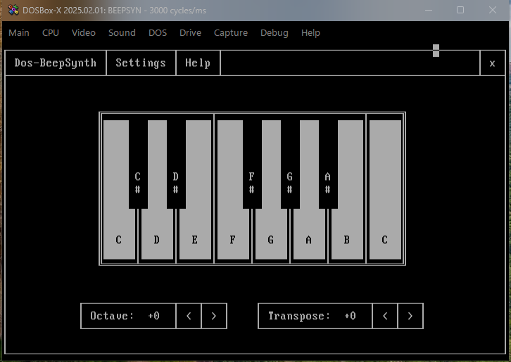
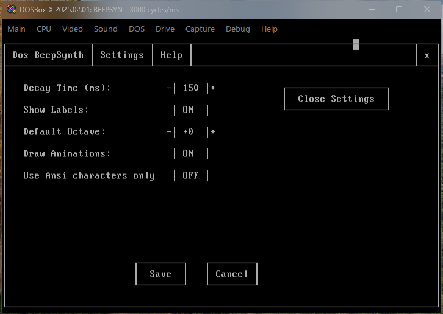
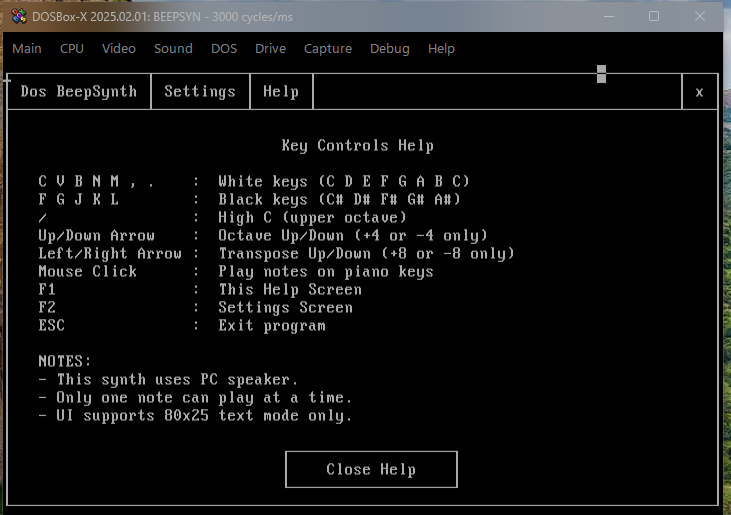

# Dos-Beepsynth

**Dos-BeepSynth** is a PC speaker synthesiser that runs in DOS (or DOSBox) or any supported operating system, featuring a text-based UI, mouse control, and full keyboard input. It provides a playable piano interface with support for octave shifting, transposition, decay control, and visual feedback. This was created because I am a music producer by profession, and I have a passion for retro hardware and software. I made it with the help of ChatGPT and Gemini Pro.

Table of Contents
- Features
- UI Modes
- Screenshots
- Keyboard Controls
- Mouse Controls
- Settings
- Requirements

## Features

- Interactive graphical interface (box-drawing or ANSI fallback)
- Play notes using your PC keyboard or mouse
- Support for both white and black keys
- Octave and transpose adjustment (with real-time pitch calculation)
- Settings panel with persistent controls
- Help screen with key mappings
- Option to use ANSI-only mode
- Mouse support (using INT 33h)
- Fully compatible with DOSBox and real-mode DOS environments

## UI Modes

You can switch between:
- **Box-drawing UI** (default for colourful rendering)
- **ANSI UI** (compatible fallback mode for systems not supporting extended characters)

## Screenshots

Running under DOSBox

Settings page

Help page

Running under Windows XP

[Watch Demo Video](video/demo.mp4)
Watch Demo Video

## Keyboard Controls

| Key         | Function                |
|-------------|-------------------------|
| C V B N M , . | White keys (C-D-E-F-G-A-B-C) |
| F G J K L   | Black keys (C#, D#, F#, G#, A#) |
| /           | High C (C6)             |
| ↑ / ↓       | Octave up/down          |
| ← / →       | Transpose up/down       |
| F1          | Help screen             |
| F2          | Settings screen         |
| ESC         | Exit                    |

## Mouse Controls

- Click the keys on the piano to play notes
- Use the UI buttons to navigate and adjust settings
- Click `x` in the top-right to quit

## Settings

- **Decay Time** (100ms–900ms)
- **Key Labels On/Off**
- **Animations On/Off**
- **Default Octave**
- **ANSI UI Mode On/Off**

## Requirements

- DOSBox or real DOS environment (MS-DOS/FreeDOS)
- Windows 95/98/ME/XP (32-bit) — with native DOS compatibility
- VGA-compatible graphics (80x25 text mode)
- PC speaker
- Keyboard + mouse (for full UI support)

